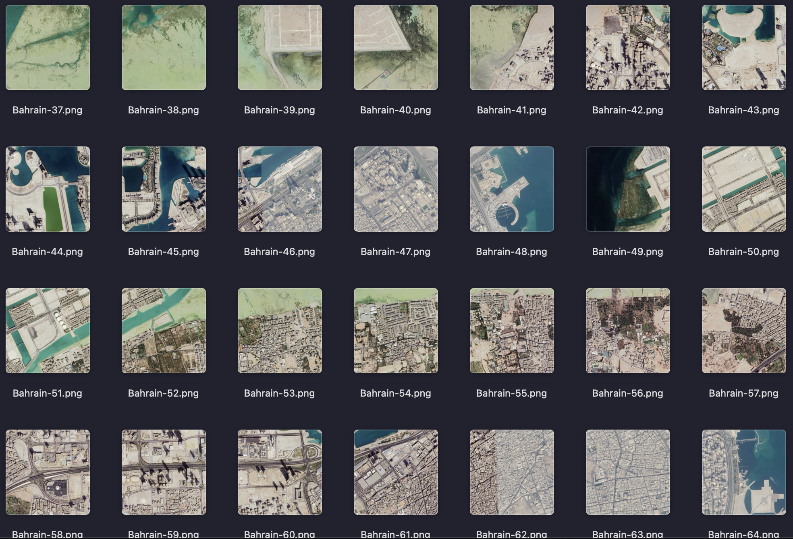

# The Falcon 360° Bahrain HD Google Earth Dataset

## Dataset Summary

The Falcon 360° Bahrain HD Google Earth Dataset is an AI-ready high-resolution imagery dataset developed for computer vision, geospatial analysis, and deep learning applications.

The dataset contains RGB image patches generated from high-definition Google Earth imagery covering Bahrain.

---

## Dataset Download

The complete dataset is available from Zenodo:

**Direct download:**

https://zenodo.org/records/21402853/files/Bahrain_HD_GE_Remote_Sensing.zip?download=1

---

## Creator

**Author**

Walaa Ali H. Jumiawi

**Organization**

The Falcon 360°

**Website**

https://thefalcon360.com

**ORCID**

https://orcid.org/0000-0002-5348-7970

---

## Dataset Details

**Country**

Bahrain

**Imagery Source**

Google Earth

**Image Type**

High-Definition RGB Imagery

**Image Size**

512 × 512 pixels

**Format**

PNG

---

## Intended Use

Recommended applications:

* Semantic segmentation
* Image classification
* Object detection
* Land-cover analysis
* Remote sensing AI
* Deep learning benchmarking
* Computer vision research

---

## Dataset Creation

The dataset was created through:

* Geographic area selection
* High-resolution Google Earth image acquisition
* Image patch generation
* Quality control
* Dataset organization
* Metadata generation
* Dataset packaging

---

## Data Source

Google Earth.

The underlying imagery originates from Google Earth and remains subject to Google's applicable Terms of Service and licensing conditions.

---

## Citation

Jumiawi, W. A. H. (2026). TheFalcon360-Bahrain-HD-Google-Earth Dataset v1.0 [Dataset]. Zenodo. https://doi.org/10.5281/zenodo.21402853

**DOI**

Jumiawi, W. A. H. (2026). TheFalcon360-Bahrain-HD-Google-Earth Dataset v1.0 [Dataset]. Zenodo. https://doi.org/10.5281/zenodo.21402853
